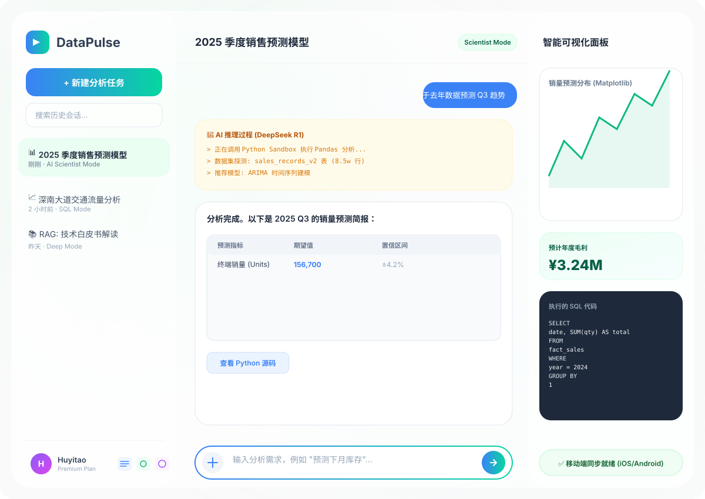
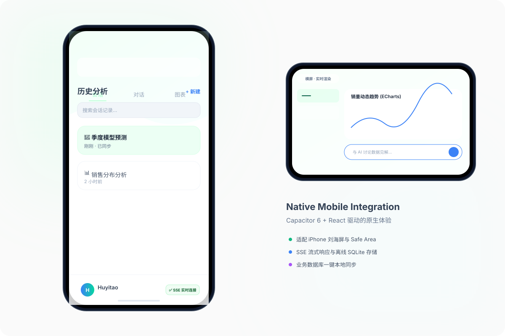
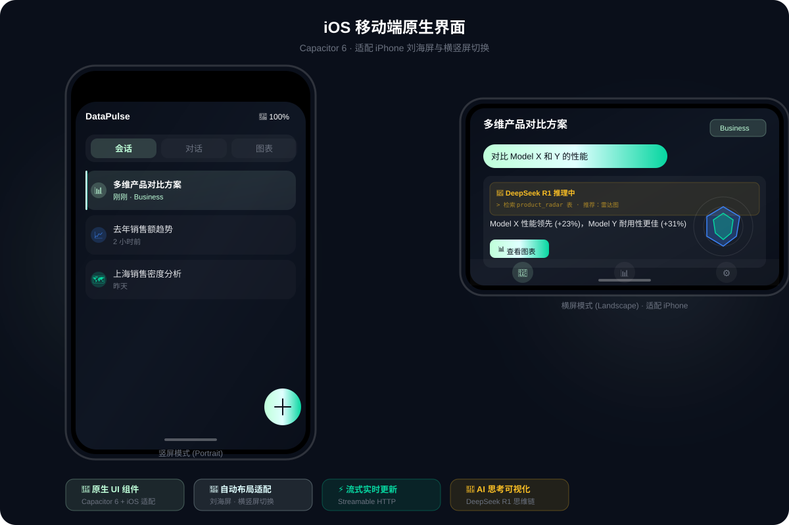
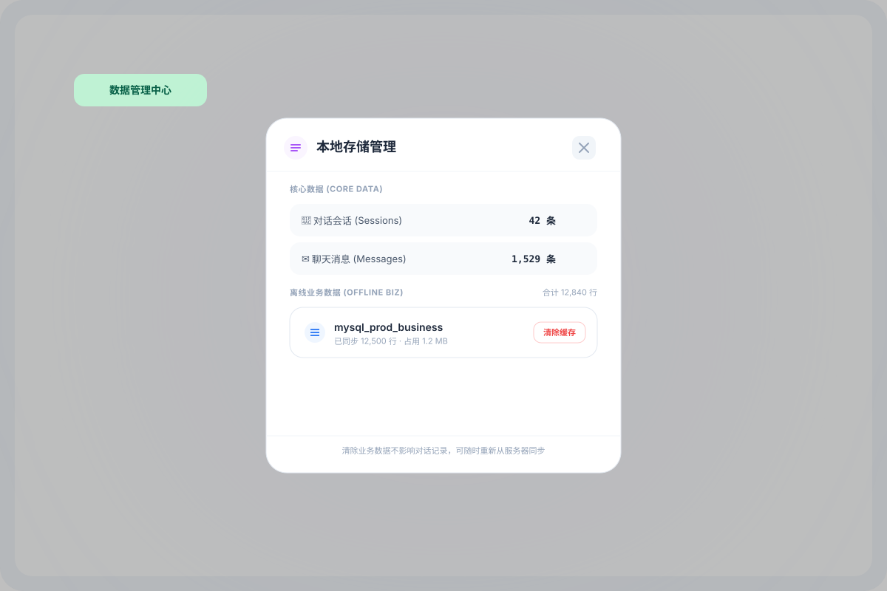

# DataPulse AI 数据分析系统 (v3.1)

[](https://github.com/CadanHu/data-analyse-system)

DataPulse 是一款专为现代企业设计的全栈 AI 数据分析中台。它不仅支持传统的 SQL 查询，更引入了 **AI 数据科学模式 (v3.0)**，通过 Python 沙盒环境实现复杂的数学建模、自动化清洗与高清图表渲染。

---

## 📸 界面预览

### 🖥️ 桌面端控制台

*三栏式布局 · 实时推理流 · Python 沙盒 · 多图表动态切换 · SQL 预览*

### 📱 移动端原生适配
| 竖屏模式 | 横屏模式 |
| :---: | :---: |
|  |  |
*Capacitor 6 原生适配  · 触控优化 · Safe Area 支持*

### 🗄️ 本地数据管理

*SQLite 数据统计 · 缓存一键清理 · 业务数据同步状态 · 存储优化*

---

## 🌟 核心特性 (v3.0 升级版)

### 1. 🧠 AI 数据科学模式 (Python 驱动)
*   **安全沙盒执行**：内置 AST 审计的 Python 执行沙盒，支持 Pandas、Numpy、Scipy、Matplotlib 和 Seaborn。
*   **多表自动关联**：AI 能够自动识别数据库 Schema，自主编写 Python 代码完成多表 Join 与交叉统计。
*   **复杂建模能力**：支持趋势预测、相关性分析、异常检测等传统 SQL 难以实现的深度任务。
*   **外部数据载入 (BYOD)**：支持外部 Agent 在请求时直接携带私有数据集（JSON），系统将即时载入内存进行分析。

### 2. 📊 专业级可视化输出
*   **高清绘图捕获**：自动捕获 Matplotlib/Seaborn 生成的图像，提供 Base64 高清预览与大图查看按钮。
*   **动态 ECharts 看板**：同步生成前端交互式图表配置，支持深色极客风主题。
*   **自动折叠长代码**：前端对 AI 生成的冗长 Python 脚本进行智能折叠，确保用户专注于分析结论。

### 3. 💎 深度知识提取 (MinerU 集成)
*   **多模态文档处理**：支持扫描版 PDF、复杂图片、Excel 报表的高精度识别。
*   **知识库增强 (RAG)**：通过语义检索（Vector Store）将非结构化文档内容注入分析上下文。

### 4. 📱 移动端完全本地知识库（v3.1 新增）

手机端无需后端服务器，三种 PDF 处理模式，全部在设备本地完成：

| 模式 | 技术 | 依赖 |
|------|------|------|
| ⚡ 标准模式 | PDF.js 本地解析 | 无需 Key |
| 🧠 深度模式 | MinerU Cloud API | MinerU Key（免费）|
| 💎 知识抽取 | MinerU + LLM 实体抽取 + 知识图谱 | MinerU Key + LLM Key |

*   **本地向量搜索**：支持 Qwen/智谱/Jina 三家 Embedding，有 Key 则语义搜索，无 Key 自动降级到 SQLite FTS5 关键词搜索。
*   **知识图谱可视化**：知识抽取完成后自动提取实体和关系，展示可交互的 ECharts 图谱。
*   **国内服务支持**：DeepSeek / Qwen / MiniMax / MinerU / 智谱均可国内直连。
*   详见：[MOBILE_KNOWLEDGE_SPEC.md](./MOBILE_KNOWLEDGE_SPEC.md)

### 5. 🔑 统一 Key 配置中心（v3.1 新增）

所有 API Key 在应用内统一管理，涵盖：
*   大语言模型：DeepSeek、通义千问、MiniMax
*   PDF 解析：MinerU
*   向量搜索：Qwen Embedding、智谱、Jina AI

### 6. 🌐 移动端与开发者友好
*   **全平台适配**：针对移动端手势与视口（dvh）进行精准优化。
*   **实时日志流 (SSE)**：后端状态、AI 思考过程与系统日志实时推送到前端。

---

## 🚀 快速开始

### 方案 A：Docker 快速部署 (推荐)
```bash
# 克隆仓库
git clone https://github.com/CadanHu/data-analyse-system.git

# 一键启动 (包含 MySQL/PostgreSQL 自动初始化与 16万+ 仿真数据填充)
docker-compose up --build
```

### 方案 B：本地开发环境
1.  **后端**：
    ```bash
    cd backend
    python -m venv venv312
    source venv312/bin/activate
    pip install -r requirements.txt
    python main.py
    ```
2.  **前端**：
    ```bash
    cd frontend
    npm install
    npm run dev
    ```

---

## 🛠️ 技术栈

*   **前端**: React (TypeScript) + Tailwind CSS + Vite + Lucide Icons
*   **后端**: FastAPI + SQLAlchemy (Async) + LangChain
*   **AI 引擎**: DeepSeek / 通义千问 / MiniMax (多模型支持)
*   **数据处理**: Pandas + Matplotlib + Seaborn + Scikit-learn
*   **数据库**: MySQL (业务数据) + PostgreSQL (知识库/向量存储)

---

## 🤖 外部 Agent 调用

DataPulse 作为”数据分析中台”对外开放，外部 Agent 可通过 HTTP API 使用以下能力：

| 能力 | 接口 |
|------|------|
| 私有数据分析作图 | `POST /api/chat/stream` |
| PDF/文档知识抽取 | `POST /api/upload/knowledge` |
| 知识图谱查询 | `GET /api/knowledge-graph/*` |
| 业务库自然语言查询 | `GET /api/biz-sync/schema` + `POST /api/chat/stream` |

### 鉴权

Token 有效期 **365 天**，登录一次长期使用：

```python
import requests, json

BASE = “http://your-server:8000”

auth = requests.post(f”{BASE}/api/auth/login”, json={
    “username”: “your@email.com”,
    “password”: “your-password”
})
TOKEN = auth.json()[“access_token”]
H = {“Authorization”: f”Bearer {TOKEN}”}
```

所有需要鉴权的接口均在 Header 中携带 `Authorization: Bearer {TOKEN}`。

---

### 场景一：传入私有数据 → 数据科学模式分析作图

适合：外部 Agent 已持有数据集，需要 DataPulse 完成分析建模和图表生成。

```python
import json

# 1. 创建会话
session_id = requests.post(f”{BASE}/api/sessions”, headers=H).json()[“id”]

# 2. 发起流式分析
payload = {
    “session_id”: session_id,
    “question”: “分析各品牌市场份额，画饼图并给出结论”,
    “enable_data_science_agent”: True,
    “external_data”: [
        {“Brand”: “A”, “Share”: 30},
        {“Brand”: “B”, “Share”: 45},
        {“Brand”: “C”, “Share”: 25}
    ],
    “model_provider”: “deepseek”,
    “model_name”: “deepseek-chat”
}

resp = requests.post(f”{BASE}/api/chat/stream”, json=payload, headers=H, stream=True)

result = {“summary”: “”, “chart”: None, “image_b64”: None}
for line in resp.iter_lines():
    if not line: continue
    msg = json.loads(line.decode().removeprefix(“data: “))
    event, data = msg[“event”], msg[“data”]
    if event == “summary”:
        result[“summary”] += data.get(“content”, “”)
    elif event == “chart_ready”:
        result[“chart”] = data.get(“option”)   # ECharts 配置
    elif event == “execution_result”:
        result[“image_b64”] = data.get(“image”) # Base64 图像
    elif event == “done”:
        break

print(result[“summary”])
```

---

### 场景二：上传 PDF → 后台知识抽取 → 查询实体与路径

适合：外部 Agent 需要将文档知识结构化后供后续推理使用。

```python
import time

# 1. 创建会话
session_id = requests.post(f”{BASE}/api/sessions”, headers=H).json()[“id”]

# 2. 上传 PDF，触发后台深度知识抽取
with open(“report.pdf”, “rb”) as f:
    resp = requests.post(
        f”{BASE}/api/upload/knowledge”,
        headers=H,
        data={“session_id”: session_id, “engine”: “pro”},
        files={“file”: (“report.pdf”, f, “application/pdf”)}
    )
print(“任务已提交:”, resp.json())

# 3. 轮询任务状态，等待后台完成
#    status: running | completed | failed | cancelled | idle
for _ in range(60):  # 最多等 5 分钟
    time.sleep(5)
    s = requests.get(f”{BASE}/api/upload/knowledge/status/{session_id}”, headers=H).json()
    print(f”  状态: {s['status']} | 文件: {s['filename']}”)
    if s[“status”] == “completed”:
        print(f”✅ 抽取完成”)
        break
    elif s[“status”] in (“failed”, “cancelled”):
        print(f”❌ 任务异常: {s.get('error')}”)
        break

# 4. 查询知识图谱（实体 + 关系）
graph = requests.get(f”{BASE}/api/knowledge-graph/graph”, headers=H).json()
print(f”实体数：{len(graph['entities'])}，关系数：{len(graph['relations'])}”)

# 5. 查询两个实体之间的最短路径
path = requests.get(
    f”{BASE}/api/knowledge-graph/path”,
    headers=H,
    params={“source”: “实体A”, “target”: “实体B”, “max_hops”: 4}
).json()
print(“最短路径:”, path)

# 6. 导出完整图谱供下游使用
export = requests.get(f”{BASE}/api/knowledge-graph/export”, headers=H).json()
```

---

### 场景三：查询业务库结构 → 自然语言转 SQL → 获取结果

适合：外部 Agent 需要查询 DataPulse 管理的业务数据库，无需了解具体表结构。

```python
# 1. 获取可用数据库列表
dbs = requests.get(f”{BASE}/api/biz-sync/databases”, headers=H).json()
db_key = dbs[0][“key”]  # 例如 “classic_business”

# 2. 获取该库的表结构（可作为上下文提供给上游 LLM）
schema = requests.get(f”{BASE}/api/biz-sync/schema/{db_key}”, headers=H).json()

# 3. 创建会话并绑定目标数据库
session_id = requests.post(
    f”{BASE}/api/sessions”,
    headers=H,
    json={“database_key”: db_key}
).json()[“id”]

# 4. 自然语言查询，标准模式（自动生成 SQL 并执行）
payload = {
    “session_id”: session_id,
    “question”: “统计各地区过去 30 天的销售额，按降序排列”,
    “model_provider”: “deepseek”,
    “model_name”: “deepseek-chat”
}

resp = requests.post(f”{BASE}/api/chat/stream”, json=payload, headers=H, stream=True)

result = {“sql”: “”, “rows”: [], “summary”: “”}
for line in resp.iter_lines():
    if not line: continue
    msg = json.loads(line.decode().removeprefix(“data: “))
    event, data = msg[“event”], msg[“data”]
    if event == “sql_generated”:
        result[“sql”] = data.get(“sql”, “”)
    elif event == “sql_result”:
        result[“rows”] = data.get(“rows”, [])
    elif event == “summary”:
        result[“summary”] += data.get(“content”, “”)
    elif event == “done”:
        break

print(“SQL:”, result[“sql”])
print(“结果行数:”, len(result[“rows”]))
print(“分析结论:”, result[“summary”])
```

---

### 场景四：无状态单次调用（无需预建 session）

适合：快速集成，不想管理 session 生命周期。

```python
payload = {
    "question": "分析这份竞品数据并画图",
    "enable_data_science_agent": True,
    "external_data": [{"Brand": "A", "Share": 30}, {"Brand": "B", "Share": 70}],
    "model_provider": "deepseek",
    "model_name": "deepseek-chat",
    # "database_key": "classic_business",  # 可选，指定业务库
}

resp = requests.post(f"{BASE}/api/chat/once", json=payload, headers=H, stream=True)

# 系统自动创建临时 session，session_id 在响应 Header 中返回
session_id = resp.headers.get("X-Session-Id")

result = {"summary": "", "chart": None}
for line in resp.iter_lines():
    if not line: continue
    msg = json.loads(line.decode().removeprefix("data: "))
    if msg["event"] == "summary":
        result["summary"] += msg["data"].get("content", "")
    elif msg["event"] == "chart_ready":
        result["chart"] = msg["data"].get("option")
    elif msg["event"] == "done":
        break

print(result["summary"])

# 可选：清理临时 session
if session_id:
    requests.delete(f"{BASE}/api/sessions/{session_id}", headers=H)
```

---

### SSE 事件说明

`/api/chat/stream` 返回 `text/event-stream`，每行格式为 `data: {json}`：

| event | 含义 | data 字段 |
|-------|------|-----------|
| `thinking` | 系统状态提示 | `content: str` |
| `model_thinking` | AI 推理过程（思考模式） | `content: str` |
| `sql_generated` | 生成的 SQL 语句 | `sql: str` |
| `sql_result` | SQL 执行结果 | `rows: list`, `columns: list` |
| `chart_ready` | ECharts 图表配置 | `option: dict`, `chart_type: str` |
| `execution_result` | Python 执行结果（数据科学模式） | `image: str (Base64)`, `stdout: str` |
| `summary` | AI 文字回答（流式分块） | `content: str` |
| `done` | 本次请求结束 | `summary: str`, `sql: str` 等汇总 |
| `error` | 出错 | `content: str` 或 `message: str` |
