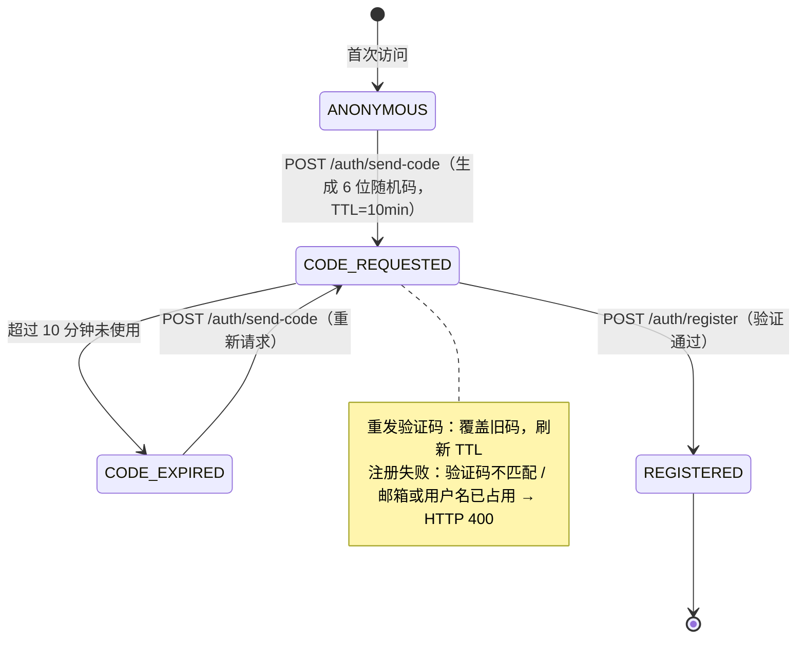
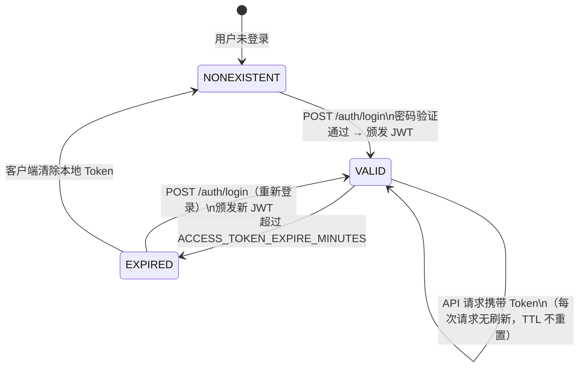
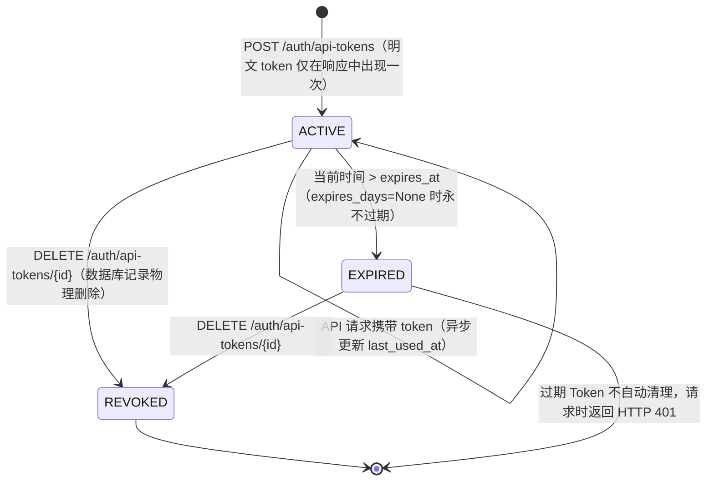

# 用户认证状态机 (Auth State Machine)

## 1. 数据模型位置

- `backend/database/user_db.py` → `UserModel`、`VerificationCodeModel`、`ApiTokenModel`

---

## 2. 认证凭据类型

系统支持两种凭据类型，在 `get_current_user` 依赖中通过前缀区分：

| 凭据类型 | 标识 | 说明 |
|---|---|---|
| **JWT Token** | Bearer `eyJ...`（标准 JWT） | 人机交互场景，有效期由 `ACCESS_TOKEN_EXPIRE_MINUTES` 控制 |
| **M2M API Token** | Bearer `dp_...`（`dp_` 前缀） | 机器间调用，支持永不过期或指定天数过期 |

---

## 3. 用户注册流程状态机

### 3.1 状态枚举

| 状态名 | 含义 |
|---|---|
| `ANONYMOUS` | 未认证访客，无数据库记录 |
| `CODE_REQUESTED` | 已请求验证码，`verification_codes` 表中存在未过期记录 |
| `CODE_EXPIRED` | 验证码已过期（超过 10 分钟），需重新请求 |
| `REGISTERED` | 验证码验证通过，`users` 表中存在记录 |

### 3.2 状态转换图



### 3.3 注册约束

| 条件 | 行为 |
|---|---|
| 无验证码记录 | HTTP 400 "请先获取验证码" |
| 验证码已过期 | HTTP 400 "验证码已过期" |
| 验证码不匹配 | HTTP 400 "验证码错误" |
| 用户名已被占用 | HTTP 400 "用户名已被占用" |
| 邮箱已注册 | HTTP 400 "邮箱已被注册" |
| 全部条件满足 | 创建用户，密码 bcrypt 哈希存储 |

---

## 4. JWT Token 状态机

### 4.1 状态枚举

| 状态名 | 含义 |
|---|---|
| `NONEXISTENT` | Token 尚未颁发 |
| `VALID` | Token 在有效期内，可用于 API 请求 |
| `EXPIRED` | Token 超过 `ACCESS_TOKEN_EXPIRE_MINUTES`，请求会返回 HTTP 401 |

### 4.2 状态转换图



### 4.3 JWT 约束

- **无状态**：JWT 不存储于数据库，无法主动撤销单个 JWT。
- **刷新**：系统不提供 refresh token 接口，Token 过期须重新登录。
- **密码变更**：当前无修改密码接口，无需处理密码变更后 Token 失效问题。
- **多端登录**：同一用户可在多端持有不同 JWT，互不干扰。

---

## 5. M2M API Token 状态机

### 5.1 状态枚举

| 状态名 | 含义 |
|---|---|
| `ACTIVE` | Token 有效，可用于 API 请求 |
| `EXPIRED` | Token 已超过 `expires_days` 设定的有效期 |
| `REVOKED` | Token 已被手动撤销，数据库记录已删除 |

### 5.2 状态转换图



### 5.3 M2M Token 约束

| 约束 | 说明 |
|---|---|
| 明文仅返回一次 | 创建时在响应中返回，此后不可再查询明文；系统存储的是 SHA-256 哈希 |
| 撤销等同删除 | `REVOKED` 后数据库无记录，不可恢复 |
| `expires_days=None` | Token 永不过期，需手动撤销 |
| 并发安全 | `last_used_at` 更新通过 `asyncio.create_task` 异步执行，不阻塞请求 |
| `scopes` 字段 | 当前仅存储，未做细粒度权限控制（保留字段） |

---

## 6. 认证中间件路由逻辑

`get_current_user` 依赖按以下顺序处理请求：

```
收到 Bearer Token
    ├─ 以 "dp_" 开头 → M2M Token 路径
    │     ├─ SHA-256 哈希匹配 → 查 ApiTokenModel
    │     ├─ 记录不存在 → HTTP 401
    │     ├─ 已过期（expires_at < now）→ HTTP 401
    │     └─ 有效 → 查 UserModel，返回用户信息
    └─ 其他 → JWT 路径
          ├─ decode_access_token 解析失败 → HTTP 401
          ├─ payload.sub（email）不存在 → HTTP 401
          └─ 用户不存在于 users 表 → HTTP 401
```
