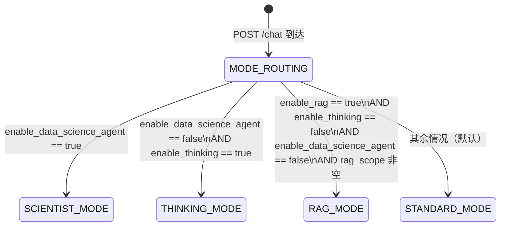
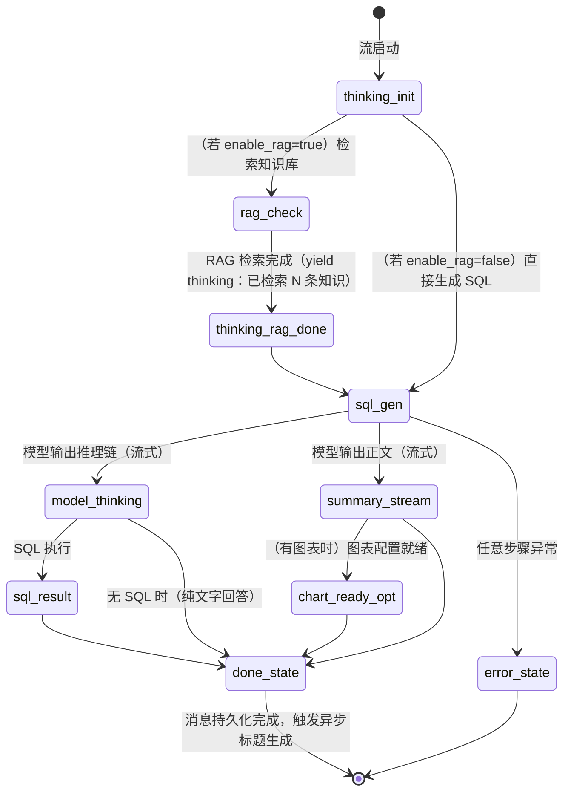
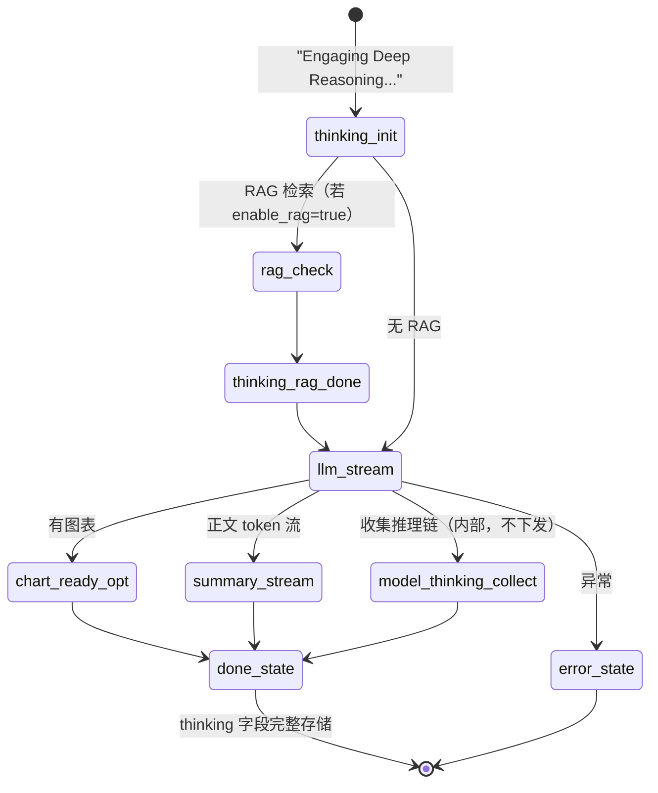
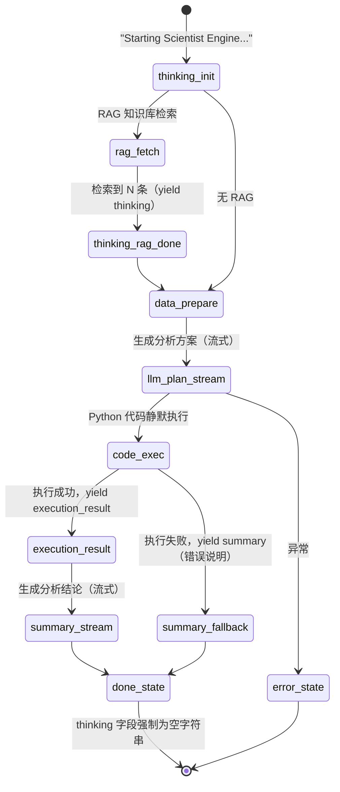
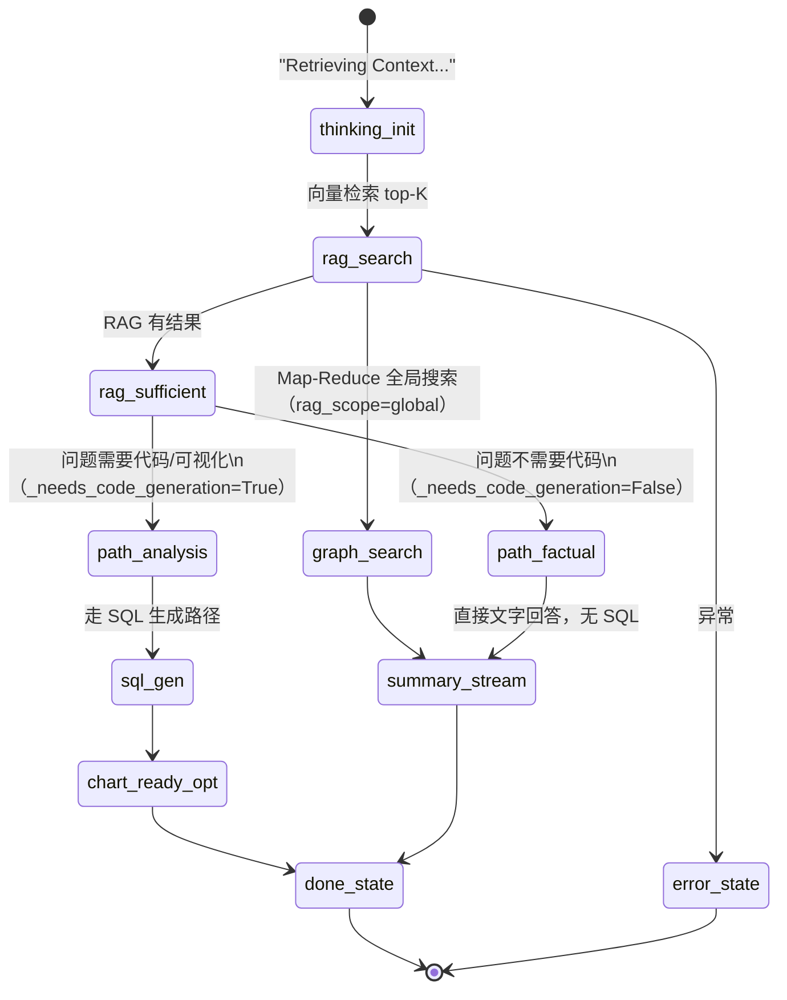

# 对话处理流状态机 (Chat Flow State Machine)

## 1. 概述

一次对话请求（`POST /chat`）是一个**异步 SSE 流式处理过程**，其生命周期由一系列离散事件（event）组成。整个过程是一个有向无环图（DAG）形式的状态机：从初始化到终态（`done` 或 `error`），中间根据配置走不同的处理路径。

---

## 2. 处理模式路由

路由层（`backend/routers/chat_router.py`）根据 Session 的模式开关，将请求分发到不同的处理器（物理隔离）：

> **优先级**：`SCIENTIST > THINKING > RAG > STANDARD`

---

## 3. SSE 事件类型

所有模式共用以下事件类型，含义固定：

| 事件名 | 方向 | 含义 |
|---|---|---|
| `thinking` | Server → Client | 处理进度提示文本（非模型推理，系统状态通知） |
| `model_thinking` | Server → Client | 模型内部推理链内容（仅 Thinking / Standard 模式）|
| `summary` | Server → Client | 模型最终回复内容（流式 token）|
| `chart_ready` | Server → Client | ECharts 图表配置就绪（含完整 option JSON）|
| `execution_result` | Server → Client | Python 代码执行结果（数据科学模式专属）|
| `db_confirmation_needed` | Server → Client | SQL 写操作需要用户确认（当前为保留事件）|
| `done` | Server → Client | 流结束，携带 `message_id`、`user_message_id` |
| `error` | Server → Client | 处理出错，携带 `message` 字段 |

**终态事件**：`done` 和 `error` 是互斥的终态，收到任意一个后 SSE 流关闭。

---

## 4. Standard Mode 事件流

---

## 5. Thinking Mode 事件流

深度推理模式，与 Standard 模式的区别：
- 强制开启模型 reasoning（`enable_thinking=True` 传递给 LLM）。
- `model_thinking` 事件必须**完整采集**并存入 `MessageModel.thinking` 字段。
- `model_thinking` 不转发给客户端（由路由层过滤，客户端通过 `done` 后查询历史消息获取）。

---

## 6. Scientist Mode 事件流

数据科学模式（Python 执行引擎），与其他模式的关键区别：
- **不采集 `model_thinking`**（强制隔离，`assistant_reasoning = ""`）。
- 产出 `execution_result` 事件而非 `chart_ready`（图表为 Base64 PNG）。
- 数据来源优先使用 `request.external_data`，其次从最近 5 条历史消息的 `data` 字段取 `rows`。

---

## 7. RAG Mode 事件流

知识库检索模式，分为两条子路径：

**RAG 子路径判断**（`AdvancedDataAgent._needs_code_generation`）：
- 命中关键词（图表、分析、趋势、chart、plot 等）→ `path_analysis`。
- 其余 → `path_factual`（直接文字回答，不生成 Python/SQL）。

---

## 8. 错误处理规则

| 阶段 | 错误类型 | 行为 |
|---|---|---|
| SQL 执行 | `table_not_found`（fatal） | 不重试，直接 yield error |
| SQL 执行 | `column_not_found`、`syntax_error`、`timeout` | 重试（最多 `MAX_RETRY_COUNT` 次） |
| SQL 执行 | `permission_denied` | fatal，不重试 |
| LLM 调用 | 任意网络/超时异常 | yield error，流关闭 |
| Python 执行 | 代码执行失败 | yield summary（错误说明），不 yield error，流正常结束 |

---

## 9. 消息持久化时机

| 事件 | 持久化动作 |
|---|---|
| 流开始（用户消息） | `create_message(role='user')` 立即写入 |
| `done` 事件触发 | `create_message(role='assistant')` 写入，携带 content/sql/chart_cfg/thinking/data |
| `error` 事件触发 | **不写入** assistant 消息（用户消息已写入） |

---

## 10. 跨模式隔离约束

| 约束 | 数据科学模式 | 思考模式 | RAG/Standard 模式 |
|---|---|---|---|
| 采集 `model_thinking` | **禁止**（强制为空） | 必须完整采集 | 可选采集 |
| 产出 `execution_result` | 是 | 否 | 否 |
| 产出 `chart_ready` | 否（图表为 Base64） | 是（若有图） | 是（若有图） |
| `thinking` 字段存储 | 强制为 `""` | 完整 reasoning 文本 | reasoning 或 `""` |
