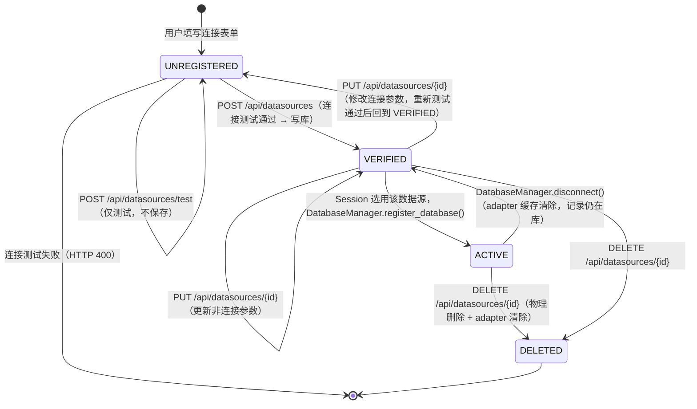

# 数据源状态机 (DataSource State Machine)

## 1. 数据模型位置

`backend/database/datasource_db.py` → `UserDatasourceModel`

> 数据源**没有显式 `status` 字段**。状态是隐式的，由"记录是否存在"和"连接是否可建立"两个维度共同决定。

核心字段：

| 字段 | 类型 | 说明 |
|---|---|---|
| `id` | `VARCHAR(64)` | UUID，主键 |
| `user_id` | `INTEGER` | 所属用户 |
| `name` | `VARCHAR(255)` | 用户定义的显示名 |
| `type` | `VARCHAR(32)` | `mysql` / `postgresql` |
| `host` / `port` / `db_name` | — | 连接参数 |
| `username` / `password_enc` | — | 认证信息（密码 Fernet 加密存储） |
| `created_at` / `updated_at` | `DATETIME` | 时间戳 |

---

## 2. 生命周期状态机

### 2.1 状态枚举

| 逻辑状态 | 含义 | 持久化位置 |
|---|---|---|
| `UNREGISTERED` | 数据源信息已填写但尚未验证，仅存在于请求载荷中 | 不持久化 |
| `VERIFIED` | 连接测试通过，记录已写入数据库 | `user_datasources` 表中存在记录 |
| `ACTIVE` | 已被某会话选用，`DatabaseManager` 中存在对应 adapter 缓存 | 内存（`DatabaseManager._configs`） |
| `DELETED` | 记录已从数据库删除，adapter 缓存已清除 | 不存在 |

### 2.2 状态转换图

---

## 3. 转换条件详述

### 3.1 创建（`UNREGISTERED → VERIFIED`）

路由：`POST /api/datasources`

执行步骤：
1. 使用请求载荷临时建立数据库连接（`_test_connection`）。
2. 连接失败 → 返回 HTTP 400，记录**不写库**。
3. 连接成功 → 密码 Fernet 加密后写入 `user_datasources`。

**约束**：密码永远以加密形式 (`password_enc`) 存储，API 响应中脱敏为 `"***"`。

### 3.2 纯测试（无状态转换）

路由：`POST /api/datasources/test`

- 建立临时连接后立即断开，不写库。
- `DatabaseManager._configs` 中的临时 key 在 `finally` 块中清除，不污染全局状态。

### 3.3 更新（`VERIFIED → VERIFIED` 或 触发重测）

路由：`PUT /api/datasources/{id}`

| 修改字段 | 是否重新测试连接 |
|---|---|
| `name`、`description` | 否 |
| `type`、`host`、`port`、`db_name`、`username`、`password` 中任一 | **是**，测试失败返回 HTTP 400 |

更新连接参数后，同时清除旧 adapter 缓存（`DatabaseManager.disconnect(db_key)`），确保下次使用新配置建立连接。

密码更新规则：
- 请求中密码为 `"***"` → 保留原加密密码不变。
- 请求中密码为其他非空字符串 → 重新加密存储。

### 3.4 激活（`VERIFIED → ACTIVE`）

由 `backend/routers/database_router.py` 或 `backend/routers/chat_router.py` 在用户选用数据源时调用 `DatabaseManager.register_database()`，将数据源配置注册到内存缓存。

- `db_key` 格式：`"user_ds_{datasource_id}"`。
- 仅在内存中存在，进程重启后失效（下次请求时按需重建）。

### 3.5 删除（`VERIFIED / ACTIVE → DELETED`）

路由：`DELETE /api/datasources/{id}`

执行步骤：
1. 校验 `user_id` 匹配。
2. 物理删除 `user_datasources` 中的记录。
3. 调用 `DatabaseManager.disconnect(db_key)` 清除内存缓存。

---

## 4. 密码安全约束

| 场景 | 密码形态 |
|---|---|
| 写库存储 | Fernet 加密密文 (`password_enc`) |
| API 对外响应 | 脱敏为 `"***"` |
| 内部建立连接 | 解密为明文（仅在进程内存中短暂存在） |
| `DatabaseManager` 缓存 | 明文（仅内存，不落盘） |

**连接测试临时 key** 的生命周期严格限制在 `_test_connection` 函数的 `try...finally` 块内，确保不泄漏到全局状态。
