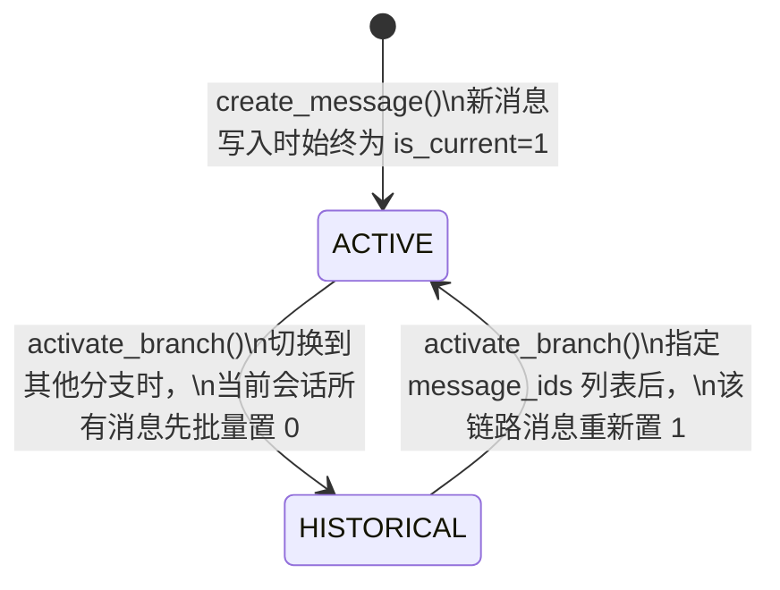
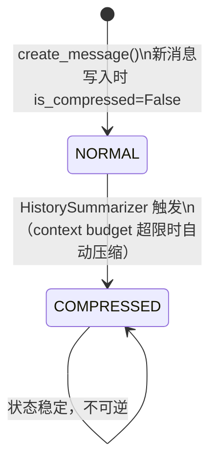
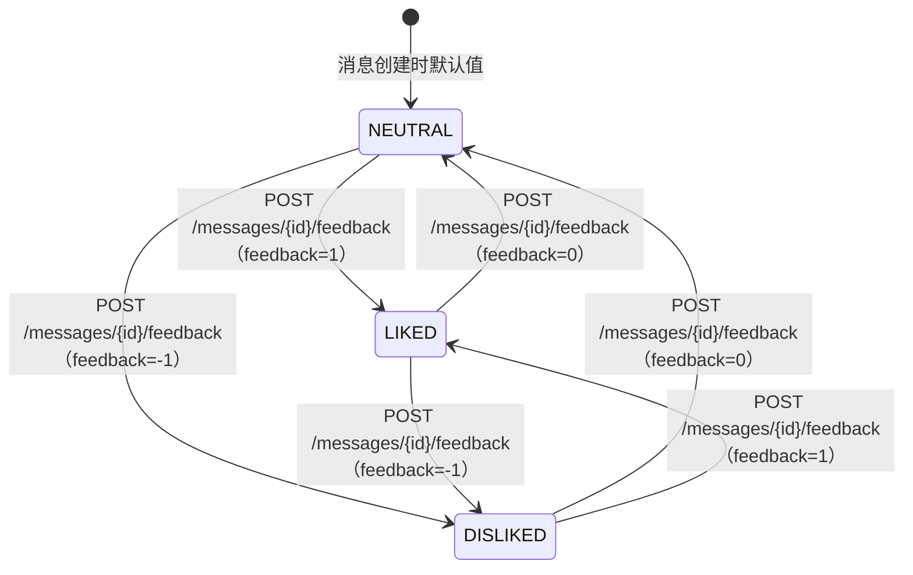

# 消息状态机 (Message State Machine)

## 1. 数据模型位置

`backend/database/session_db.py` → `MessageModel`

核心字段：

| 字段 | 类型 | 默认值 | 状态维度 |
|---|---|---|---|
| `role` | `VARCHAR(20)` | — | `user` / `assistant`（不可变） |
| `is_current` | `INTEGER` | `1` | 分支活跃态 |
| `is_compressed` | `BOOLEAN` | `False` | 压缩态 |
| `feedback` | `INTEGER` | `0` | 用户反馈态 |
| `parent_id` | `VARCHAR(64)` | `NULL` | 对话分支关联（不是状态，但决定分支拓扑） |

消息是**不可变内容**对象：`content`、`sql`、`chart_cfg`、`thinking`、`data` 字段在写入后**不修改**。状态变化仅发生在上述四个状态字段上。

---

## 2. 维度一：分支活跃态（`is_current`）

### 2.1 状态枚举

| 字段值 | 状态名 | 含义 |
|---|---|---|
| `1` | `ACTIVE` | 当前活跃分支的成员，参与上下文窗口构建和历史展示 |
| `0` | `HISTORICAL` | 非活跃历史分支，不参与当前对话上下文，但物理保留 |

### 2.2 状态转换图

### 2.3 转换规则

**切换分支**（`POST /sessions/{id}/activate_branch`）是一个**原子操作**，分两步执行：

1. `UPDATE messages SET is_current = 0 WHERE session_id = :sid`（整会话全部置为历史）
2. `UPDATE messages SET is_current = 1 WHERE id IN :ids`（目标分支链路逐条置为活跃）

约束：
- 传入的 `message_ids` 必须属于同一 `session_id`，否则数据库层面无错误但语义错误（调用方责任）。
- 获取消息列表时（`GET /sessions/{id}/messages`）：
  - `all=false`（默认）：只返回 `is_current=1 AND is_compressed=False` 的消息。
  - `all=true`：返回会话下所有消息，不过滤分支和压缩状态。

---

## 3. 维度二：压缩态（`is_compressed`）

### 3.1 状态枚举

| 字段值 | 状态名 | 含义 |
|---|---|---|
| `False` (0) | `NORMAL` | 完整消息，内容未被摘要压缩 |
| `True` (1) | `COMPRESSED` | 消息内容已由 `HistorySummarizer` 处理并压缩摘要，原始内容不再直接参与 context 构建 |

### 3.2 状态转换图

> 压缩时的副作用：摘要 assistant 消息同步写入（`is_current=1, is_compressed=False`），原消息标记 `is_compressed=True`。

### 3.3 触发条件

`HistorySummarizer`（`backend/database/session_db.py`）在以下条件触发：

- 每次 `create_message()` 写入 assistant 消息后，由调用方判断是否需要压缩（context budget 机制）。
- 压缩过程：将历史消息批量标记为 `is_compressed=True`，同时写入一条新的摘要 assistant 消息（`is_current=1, is_compressed=False`）。

约束：
- 压缩是**单向不可逆**的。
- 仅压缩 `is_current=1` 的消息，不压缩历史分支消息。

---

## 4. 维度三：用户反馈态（`feedback`）

### 4.1 状态枚举

| 字段值 | 状态名 | 含义 |
|---|---|---|
| `0` | `NEUTRAL` | 未评价 |
| `1` | `LIKED` | 用户点赞 |
| `-1` | `DISLIKED` | 用户点踩，通常附带 `feedback_text` |

### 4.2 状态转换图

### 4.3 转换规则

- 仅 `role=assistant` 的消息有反馈意义，但数据库层面不做约束。
- `feedback_text` 仅在 `DISLIKED` 状态下有业务意义；其他状态下传入也不报错，但无用。
- 反馈**可以任意次数变更**（无幂等限制，以最后一次 API 调用为准）。

---

## 5. 三个维度的交叉约束

| 场景 | is_current | is_compressed | feedback | 行为 |
|---|---|---|---|---|
| 正常活跃消息 | `1` | `0` | `0/1/-1` | 参与上下文，可评价 |
| 已被压缩的历史 | `1` | `1` | `0/1/-1` | 不参与上下文构建，评价字段保留 |
| 非活跃分支 | `0` | `0/1` | `0/1/-1` | `all=false` 查询不可见 |
| 新写入的摘要消息 | `1` | `0` | `0` | 替代已压缩消息参与上下文 |
