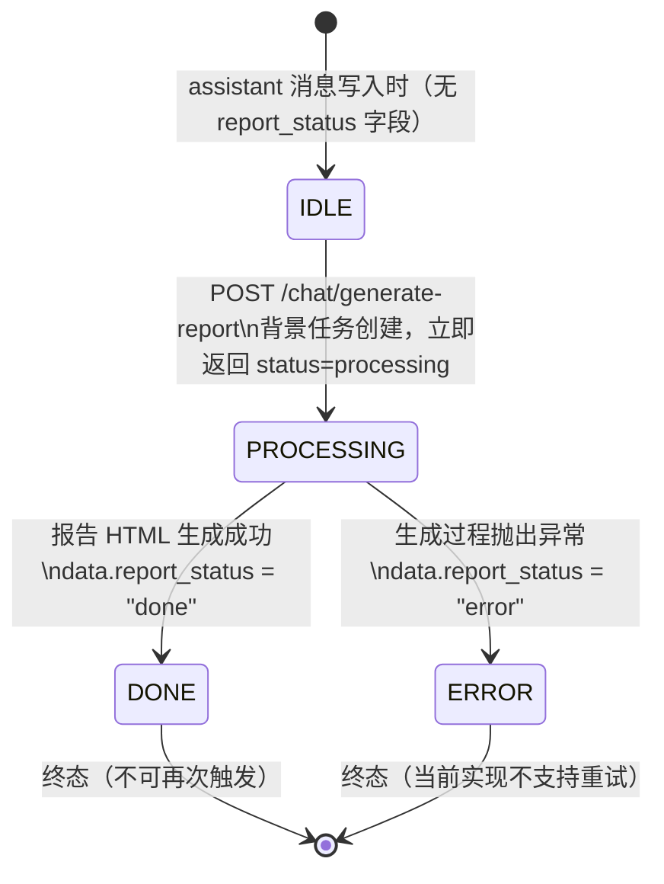
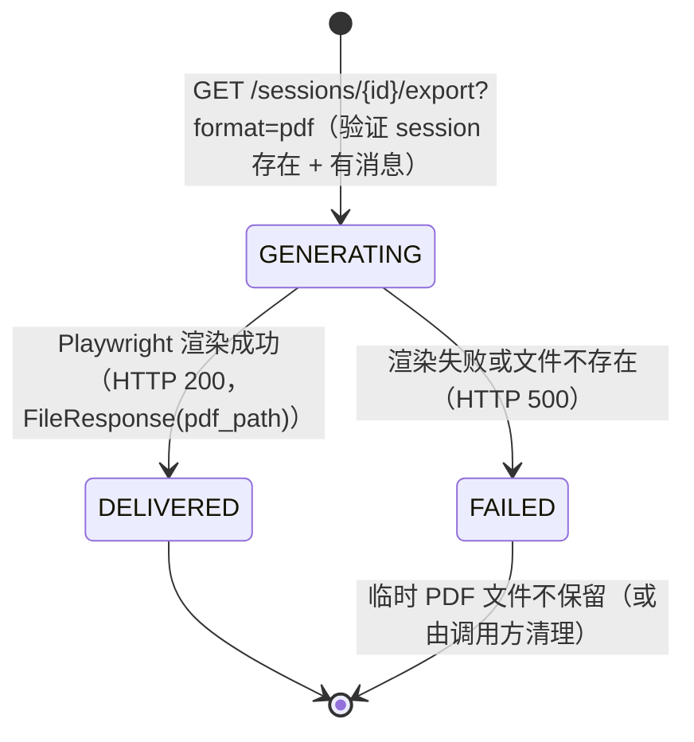

# 报告生成状态机 (Report Generation State Machine)

## 1. 概述

系统支持两种报告生成路径，均为**异步后台任务**，状态通过消息 `data` 字段中的 `report_status` JSON 键传递：

| 路径 | 触发方式 | 生成内容 |
|---|---|---|
| **AI 分析报告** | `POST /chat/generate-report` | 基于指定 message 内容，AI 生成 HTML 报告 |
| **会话导出** | `GET /sessions/{id}/export?format=pdf` | 将整个会话渲染为 PDF（Playwright 同步） |

---

## 2. 数据模型

`report_status` 存储于 `MessageModel.data`（JSON 字符串）内的 `report_status` 键，**没有独立表**。

相关代码位置：
- `backend/routers/chat_router.py` → `generate_report()` 路由
- `backend/services/knowledge_extraction_service.py` → 实际生成逻辑

---

## 3. AI 分析报告状态机

### 3.1 状态枚举

| `report_status` 值 | 状态名 | 含义 |
|---|---|---|
| `(字段不存在)` | `IDLE` | 该消息尚未触发报告生成 |
| `"processing"` | `PROCESSING` | 后台任务已创建，正在生成中 |
| `"done"` | `DONE` | 报告已成功生成，`data` 中包含报告内容 |
| `"error"` | `ERROR` | 生成失败，`data` 中包含错误信息 |

### 3.2 状态转换图

### 3.3 触发条件

**前置条件**（`POST /chat/generate-report`）：
- 请求中的 `message_id` 必须存在于数据库，且属于 `current_user`（通过 `session_id` 间接验证）。
- 同一 `message_id` **不做幂等控制**（当前实现允许重复触发，会覆盖 `report_status`）。

**后台任务触发时序**：
1. 路由立即更新 `data.report_status = "processing"`，写库。
2. 路由返回 HTTP 200 `{ "status": "processing" }`。
3. `BackgroundTasks` 异步执行实际生成逻辑。
4. 生成成功 → 更新 `data.report_status = "done"` + 写入报告内容。
5. 生成失败 → 更新 `data.report_status = "error"`。

---

## 4. 会话导出（PDF）状态机

会话导出是**同步阻塞**调用（Playwright），无 `report_status` 字段，状态直接由 HTTP 响应码表示。

### 4.1 支持的导出格式

| `format` 参数 | 响应类型 | 实现方式 |
|---|---|---|
| `txt` | `text/plain` | 字符串拼接，同步返回 |
| `md` | `text/markdown` | 字符串拼接，同步返回 |
| `pdf` | `application/pdf` | Playwright 渲染，同步阻塞 |
| 其他 | HTTP 400 | — |

---

## 5. 约束与边界

| 约束 | 说明 |
|---|---|
| `report_status` 是内嵌 JSON 字段 | 非数据库列，无法通过 SQL WHERE 查询，只能全量读取后解析 |
| PDF 导出无异步轮询接口 | 客户端须等待响应，超时由反向代理（Nginx/ALB）控制 |
| 报告生成不依赖会话模式 | 任意模式（Standard/Thinking/Scientist/RAG）产生的 assistant 消息均可触发 |
| 错误不重试 | 当前实现无重试机制；如需重试，客户端需重新调用 `POST /chat/generate-report` |
