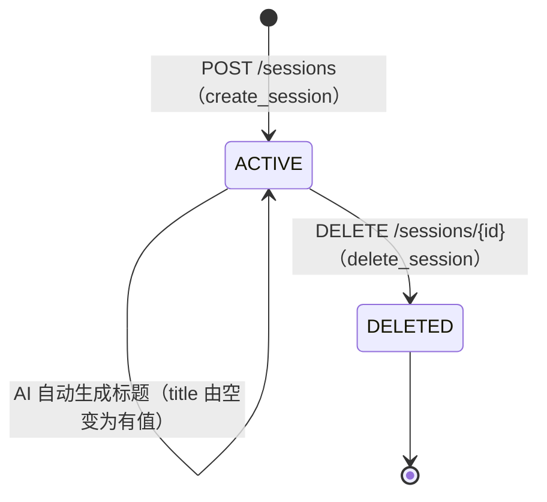
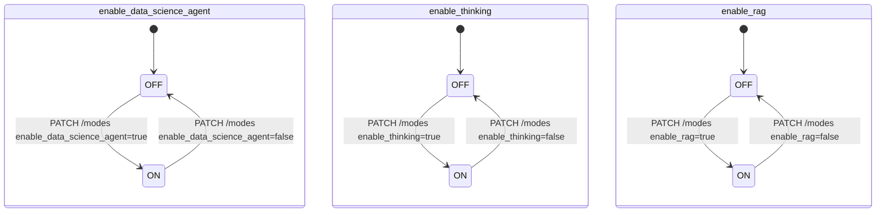

# 会话状态机 (Session State Machine)

## 1. 数据模型位置

`backend/database/session_db.py` → `SessionModel`

核心字段：

| 字段 | 类型 | 默认值 | 说明 |
|---|---|---|---|
| `status` | `VARCHAR(20)` | `'active'` | 会话生命周期状态 |
| `enable_data_science_agent` | `BOOLEAN` | `False` | 数据科学模式开关 |
| `enable_thinking` | `BOOLEAN` | `False` | 深度推理模式开关 |
| `enable_rag` | `BOOLEAN` | `False` | 知识库检索模式开关 |
| `model_provider` | `VARCHAR(32)` | `NULL` | 用户选定的模型供应商 |
| `model_name` | `VARCHAR(128)` | `NULL` | 用户选定的模型名称 |

---

## 2. 生命周期状态机

### 2.1 状态枚举

| 状态值（数据库） | 逻辑状态名 | 含义 |
|---|---|---|
| `'active'` | `ACTIVE` | 会话正常可用，用户可继续对话 |
| `'archived'` | `ARCHIVED` | 会话被归档，不可继续对话，但历史消息保留（保留字，当前未启用） |
| `(记录已删除)` | `DELETED` | 会话及其所有消息已从数据库物理删除 |

> **注意**：当前版本不存在 `ARCHIVED` 状态的业务逻辑，删除操作直接物理删除。此处保留以备未来扩展。

### 2.2 状态转换图



### 2.3 转换条件与约束

| 转换 | 触发 API | 前置条件 | 副作用 |
|---|---|---|---|
| `[*] → ACTIVE` | `POST /sessions` | 用户已登录（JWT/API Token 有效） | 创建 `SessionModel` 记录，`title` 为空字符串 |
| `ACTIVE → ACTIVE`（改标题） | `PATCH /sessions/{id}` | `user_id` 匹配，`title` 长度 ≤ 200 | 更新 `title`、`updated_at` |
| `ACTIVE → ACTIVE`（改模式） | `PATCH /sessions/{id}/modes` | `user_id` 匹配 | 更新 `enable_*` / `model_provider` / `model_name` |
| `ACTIVE → ACTIVE`（绑定 DB） | `POST /sessions/{id}/database` | `user_id` 匹配，`database_key` 合法 | 更新 `database_key` |
| `ACTIVE → DELETED` | `DELETE /sessions/{id}` | `user_id` 匹配 | 物理删除全部关联 `MessageModel` 记录，再删除 `SessionModel` |

---

## 3. 模式开关（Mode Flags）

模式开关不是独立的状态机，而是 `ACTIVE` 状态下的并发配置维度。三个开关彼此独立，但存在**业务互斥语义**（路由层根据优先级选择处理器）：

```
优先级（高 → 低）：
  enable_data_science_agent  →  Scientist Mode 处理器
  enable_thinking            →  Thinking Mode 处理器
  enable_rag                 →  RAG Mode 处理器（rag_scope=session / global）
  (none)                     →  Standard Mode 处理器
```

### 模式开关转换



### AI 自动命名规则

- **触发条件**：会话首次收到 AI 回复完成（`done` 事件）且 `title` 为空字符串。
- **执行方式**：`asyncio.create_task`（后台异步，不阻塞响应）。
- **使用模型**：强制使用 `model_name=None`（供应商默认标准模型），不使用 thinking 重型模型。
- **幂等性**：若 `title` 已有值，则跳过，不覆盖。
