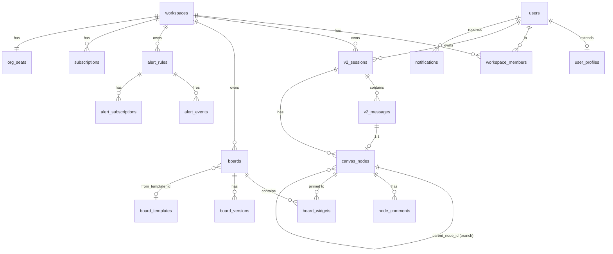

# v2 数据库 Schema 设计文档

**作者**：CadanHu + Claude
**日期**：2026-05-25
**状态**：草案，待评审 — 评审通过后按"实施路线"分批落地

---

## 1. 目标与约束

- 实现 v2 设计稿（`/v2-preview/*` 系列，共 22 个画板，覆盖 P0/P1/P2 全部功能模块）
- **保留旧表数据不动**：现有 `sessions / messages / user_api_keys / users / user_datasources / knowledge_*` 等表继续服务 `/app` 旧版界面
- **新设计全部走新表**：v2 路线下所有功能落到新 schema，与旧 schema 解耦，互不影响
- 双写并存的过渡期靠路由分流，不靠表共享

## 2. 与旧表的关系

| 旧表 | 新表对应 | 关系 |
|---|---|---|
| `sessions` | `v2_sessions` | 完全独立，不共享 id |
| `messages` | `v2_messages` + `canvas_nodes` | 拆成"内容"和"画布拓扑"两层 |
| `users` | `users`（**继续用**） + `user_profiles`（新建扩展表，1:1） | 用户身份不重复，新字段挂扩展表 |
| `user_api_keys` | 旧表继续；`api_keys_v2` 是组织级 API Key（语义不同） | 新表新语义，不迁移 |
| `user_datasources` | **继续用**；`datasource_tables_meta` / `column_meta` 新建 | 数据源连接信息不重做，只补语义元数据 |
| `knowledge_*` | **完全不动** | RAG 系统独立，与 v2 无交集 |

**关键决策：用户表不重做。** 用 `user_profiles` 扩展表挂偏好/角色等新字段，避免迁移历史用户数据。

## 3. 命名 / 共同字段约定

- **新表命名前缀**：跨域共享的核心实体用 `v2_` 前缀（`v2_sessions` / `v2_messages`），其它新模块用领域名（`workspaces` / `boards` / `alert_rules`）
- **主键**：`String(36)` UUID；时间戳用 `DateTime UTC`
- **共同字段**（除关联表外，所有业务表都有）：
  - `id` PK
  - `created_at` (default now)
  - `updated_at` (default now, on_update now) — 仅用于"会被修改"的实体
- **JSON 字段**：MySQL 用 `JSON` 类型（5.7+），需要复杂查询的字段（如 `tags`）单独建索引列
- **外键**：跨表 FK 都加（即便业务上能保证），便于级联清理
- **软删除**：不引入 `deleted_at`；删了就删，由 `audit_logs` 留痕

## 4. 数据库选型

继续 **MySQL**（与旧表同实例同库 `data_pulse_sessions`，或独立新库 `data_pulse_v2`——见 §10）。

不引入 PostgreSQL 是因为：JSON 字段虽多，但都是 "存读" 而非 "JSON 内部查询"。如果未来发现需要 GIN 索引（比如全文搜画板模板），单独把那张表挪 PG。

## 5. 模块清单（共 36 张新表，按域分组）

### 模块 1 · 用户扩展（5 表）

| 表 | 主键 | 关键字段 | 用途 |
|---|---|---|---|
| `user_profiles` | `user_id` PK FK→users | `display_name`, `role`(enum: exec/sales/pm/ops/analyst/admin), `team_id`, `avatar_url`, `lang`, `theme`(light/dark/auto), `density`(cozy/compact), `shortcuts_json` | 设置中心-个人页 |
| `user_2fa` | `user_id` PK FK | `secret`, `backup_codes_hash`(JSON), `enabled_at`, `last_used_at` | 设置-安全 |
| `user_login_sessions` | `id` | `user_id`, `ip`, `ua`, `device_label`, `last_active_at`, `revoked_at` | 设置-多设备会话 |
| `user_notification_prefs` | (`user_id`, `channel`, `event_type`) | `enabled`(bool), `dnd_start_min`(0-1439), `dnd_end_min` | 4 渠道(email/im/push/inapp) × 8 场景 |
| `oauth_authorized_apps` | `id` | `user_id`, `client_id`, `client_name`, `scope`(JSON), `authorized_at`, `last_used_at`, `revoked_at` | 设置-授权应用 |

### 模块 2 · 工作区（2 表）

| 表 | 主键 | 关键字段 | 用途 |
|---|---|---|---|
| `workspaces` | `id` | `name`, `slug`(unique), `owner_user_id`, `plan_tier`(free/team/enterprise) | TeamWorkspace 顶层容器 |
| `workspace_members` | (`workspace_id`, `user_id`) | `role`(owner/admin/editor/viewer), `joined_at`, `invited_by_user_id` | 成员 + 4 类角色 |

### 模块 3 · 画布节点（5 表 · v2 核心）

| 表 | 主键 | 关键字段 | 用途 |
|---|---|---|---|
| `v2_sessions` | `id` | `workspace_id`, `owner_user_id`, `title`, `model_provider`, `model_name`, `mode_flags_json`(thinking/rag/data-science) | 替代旧 sessions |
| `v2_messages` | `id` | `session_id`, `parent_msg_id`(LLM 候选树用), `role`(user/assistant/system), `content`, `sql`, `chart_cfg_json`, `data_json`, `thinking_steps_json`(数组,不是裸 text!), `elapsed_ms`, `tokens_prompt`, `tokens_completion`, `confidence`(0-1), `model_provider`, `model_name` | 替代旧 messages，承载"内容"层 |
| `canvas_nodes` | `id` | `session_id`, `parent_node_id`(画布分支父节点), `message_id` FK→v2_messages, `branch_label`("分支 A · 仅抖音"), `branch_color`, `pinned_to_board_id`, `clarify_status`(none/pending/cleared/skipped), `hitl_status`(none/waiting/approved/rejected), `position_index`(时间线排序) | 画布"拓扑"层，独立于 message |
| `node_comments` | `id` | `node_id`, `user_id`, `body`, `parent_comment_id`, `resolved_at` | NodeDetail-评论 tab |
| `node_mentions` | (`node_id`, `mentioned_user_id`) | `by_user_id`, `created_at`, `read_at` | @提及，催化 notifications |

**关键设计：`canvas_nodes` 和 `v2_messages` 分离**
- `v2_messages` 管 LLM 内容（一次 turn 可能产生多条 assistant 候选，由 `parent_msg_id` 串成 LLM 重试树）
- `canvas_nodes` 管画布叙事（每个节点就是用户在画布上看到的一张卡，可分支、可钉看板、可独立有评论/血缘）
- 一个 message 对应一个 canvas_node（1:1），但 canvas_node 携带画布专属元数据（分支标签、置信度、HITL 状态等），而 messages 表只关心内容本身。

### 模块 4 · 看板（4 表）

| 表 | 主键 | 关键字段 | 用途 |
|---|---|---|---|
| `boards` | `id` | `workspace_id`, `title`, `description`, `grid_cols`(默认 12), `schedule_cron`, `owner_user_id`, `from_template_id`(可空) | BoardEditor 主体 |
| `board_widgets` | `id` | `board_id`, `source_node_id` FK→canvas_nodes, `grid_x`, `grid_y`, `w`, `h`, `override_cfg_json`(覆盖标题/图表配色), `order_index` | 12 栅格里的每张图 |
| `board_versions` | `id` | `board_id`, `version_num`, `layout_snapshot_json`(整张看板快照), `changed_by_user_id`, `change_summary` | 版本对照 v2↔v4 |
| `board_templates` | `id` | `category`, `name`, `preview_url`, `layout_json`, `is_builtin` | 6 个行业起手式 |

### 模块 5 · 分享（2 表）

| 表 | 主键 | 关键字段 | 用途 |
|---|---|---|---|
| `share_links` | `id` | `target_type`(session/board/node), `target_id`, `token`(unique), `permission`(view/comment/edit), `expires_at`, `created_by`, `revoked_at` | 链接分享 |
| `share_grants` | `id` | `target_type`, `target_id`, `user_id`, `permission`, `granted_by`, `granted_at` | 指定人分享（不通过链接） |

### 模块 6 · 通知（1 表）

| 表 | 主键 | 关键字段 | 用途 |
|---|---|---|---|
| `notifications` | `id` | `recipient_user_id`, `type`(mention/comment/alert/share/system), `source_type`, `source_id`, `payload_json`(渲染所需的所有信息), `read_at`, `actioned_at` | 通知中心统一收件箱 |

### 模块 7 · 告警（3 表）

| 表 | 主键 | 关键字段 | 用途 |
|---|---|---|---|
| `alert_rules` | `id` | `workspace_id`, `name`, `metric_id` FK→metrics(可空，也可绑 board_widget), `widget_id`(可空), `threshold_json`(比较符 + 阈值 + 窗口), `schedule_cron`, `channels_json`(渠道+模板), `owner_user_id`, `enabled` | AlertWizard 创建的规则 |
| `alert_events` | `id` | `rule_id`, `fired_at`, `current_value`, `threshold_value`, `severity`(info/warn/critical), `attribution_json`(AI 归因结果), `status`(open/ack/resolved), `resolved_at`, `resolved_by_user_id` | AlertDetail 同环比+AI 归因 |
| `alert_subscriptions` | (`rule_id`, `user_id`) | `channel_overrides_json`(可覆盖渠道偏好), `subscribed_at` | 个人订阅 |

### 模块 8 · 审计（1 表）

| 表 | 主键 | 关键字段 | 用途 |
|---|---|---|---|
| `audit_logs` | `id` | `actor_user_id`, `workspace_id`(可空,平台级动作), `action`(create/update/delete/share/revoke/...), `target_type`, `target_id`, `diff_json`(改动前后), `ip`, `ua`, `request_id` | AdminAudit "谁·什么时候·改了什么" |

### 模块 9 · 计费（4 表）

| 表 | 主键 | 关键字段 | 用途 |
|---|---|---|---|
| `subscriptions` | `id` | `workspace_id`, `plan`(free/team/business/enterprise), `billing_cycle`(monthly/yearly), `valid_from`, `valid_until`, `auto_renew`, `external_subscription_id` | 套餐订阅 |
| `org_seats` | `workspace_id` PK | `used_count`, `limit_count`, `updated_at` | 席位用量 |
| `usage_counters` | (`workspace_id`, `period_yyyymm`) | `asks_count`, `tokens_total`, `compute_seconds_total`, `storage_bytes_avg` | 月度用量 |
| `invoices` | `id` | `workspace_id`, `period_yyyymm`, `amount_cents`, `currency`, `status`(draft/issued/paid/void), `pdf_url`, `paid_at` | 发票 |

### 模块 10 · 模型与算力（3 表）

| 表 | 主键 | 关键字段 | 用途 |
|---|---|---|---|
| `model_routes` | `id` | `workspace_id`, `intent_pattern`(简单关键词/正则), `target_model`, `priority`, `enabled` | 路由策略：哪种问题用哪个模型 |
| `model_budgets` | (`workspace_id`, `model_name`, `period_yyyymm`) | `monthly_cap_usd_cents`, `used_cents`, `alert_threshold_pct`(超过 80% 报警) | 预算环可视化 |
| `api_keys_v2` | `id` | `workspace_id`, `name`, `key_prefix`(显示用), `key_hash`(bcrypt), `scopes_json`, `created_by_user_id`, `last_used_at`, `rotated_from_id`, `revoked_at` | 组织级 API Key + 轮换链 |

### 模块 11 · 语义层 / 指标（C 档，6 表，**可推迟**）

| 表 | 主键 | 关键字段 | 用途 |
|---|---|---|---|
| `datasource_tables_meta` | (`ds_id`, `schema_name`, `table_name`) | `row_count_estimate`, `last_synced_at`, `comment` | SchemaSemantic 树 |
| `column_meta` | `id` | `ds_id`, `schema_name`, `table_name`, `column_name`(unique 组合), `dtype`, `null_ratio`, `distinct_count`, `sample_values_json`, `comment` | 字段浏览 |
| `column_semantic_tags` | (`column_id`, `tag_name`) | `confidence`(0-1), `source`(ai/user/manual), `tagged_by`, `tagged_at` | "字段语义打标" |
| `metrics` | `id` | `workspace_id`, `name`, `expression`(SQL 片段或 DSL), `biz_definition`, `unit`, `owner_user_id` | 指标中心业务口径 |
| `metric_synonyms` | (`metric_id`, `synonym_text`) | `weight`, `source`(ai/user) | AI 同义词 |
| `metric_lineage` | (`from_metric_id`, `to_type`, `to_id`) | `to_type`(metric/table_column), `relation`(uses/derives) | LineageDrawer 数据血缘 |

> **C 档独立讨论**：metric 的 `expression` 用什么 DSL？AI 同义词靠规则还是 embedding？这两个问题不解决就强行落表会被未来需求逼着重做。建议 P0/P1 不上 C 档，等业务真的需要"指标中心"时再单独立项。

---

## 6. ER 图（核心域）

---

## 7. 关键决策记录

### 决策 1：canvas_nodes 与 v2_messages 拆表（不合并）

**对比方案 A**（合并）：一张 `v2_messages` 表，加 `branch_label / pinned_to_board_id` 等画布字段。
**选定方案 B**（拆分）：`v2_messages` 只管内容，`canvas_nodes` 管画布拓扑。

**理由**：
- 一个 LLM turn 可能有多个候选 assistant message（用户点"重新生成"）。这些候选在 `v2_messages` 里通过 `parent_msg_id` 形成树，但**画布上只展示用户选定的那一个**。如果把画布字段塞在 message 上，候选消息会污染画布拓扑
- 未来如果引入"同一个 message 出现在多个画布"（虽然现在没需求），拆表也支持
- 代价：1 个额外 JOIN，可接受

### 决策 2：用户表不重做

`users` 表继续用旧表（避免迁移用户数据 / 影响登录 / 影响旧 `/app`），新字段全部挂 `user_profiles` 扩展表（1:1）。

### 决策 3：组织级 API Key 单独建 `api_keys_v2`

旧 `user_api_keys` 是"用户自己存的第三方 LLM API Key（用于离线模式）"，与 v2 设计稿里的"组织级 API Key 用于外部系统调用 DataPulse 接口"语义完全不同。强行复用会让权限模型变成噩梦。

### 决策 4：通知统一收件箱 `notifications`，不为每种类型建表

`mention / comment / alert / share / system` 都进同一张表，差异由 `type + payload_json` 表达。
**理由**：通知的关键操作是"标记已读 / 按时间倒排 / 用户偏好过滤"，这些都不需要区分类型。差异只在渲染层，前端按 type 选模板。

### 决策 5：审计日志不分多表

`audit_logs` 一张表覆盖所有动作（不为 sessions/boards/alerts 各建审计表）。
**理由**：审计基本只查"某人某段时间做了什么 / 某资源被谁改过"，这些都是按 `actor_user_id + created_at` 或 `target_type + target_id` 索引即可。多表只增加查询复杂度。

### 决策 6：JSON 字段无索引

`thinking_steps_json / chart_cfg_json / payload_json / diff_json / attribution_json` 等字段都不建索引。
**理由**：这些是 "存读" 而非 "JSON 内部查询"。如果未来某个字段需要查询（如审计想按 diff 的具体字段过滤），单独把那字段提出来变列。

### 决策 7：金额用 cents 整数

`amount_cents / monthly_cap_usd_cents / used_cents` 全部 `Integer` 不用 `Decimal`。
**理由**：避免浮点累计误差；显示时 `/ 100`。`currency` 单独列。

---

## 8. 双写共存：路由分流

**旧表服务旧路由：**
- `/app` 全套（SessionList / ChatArea / RightPanel）→ `sessions / messages / user_api_keys`
- `/login` / `/register` / `/about` 等 → `users / api_tokens`

**新表服务 v2 路由：**
- `/v2-preview/canvas` → 切到 `v2_sessions / v2_messages / canvas_nodes`（**需要重写当前的 messagesToNodes**）
- `/v2-preview/share` / `/team` / `/board-*` / `/alert-*` / `/admin/*` / `/settings/*` → 各域新表

**过渡期共存：**
- 用户表共享，登录走旧逻辑
- v2 路由要求用户先在 v2 创建 workspace（首次访问引导）
- 旧 `/app` 完全不感知 v2 的存在；v2 完全不读旧 `messages`

---

## 9. 实施路线（按优先级）

### 阶段 1：地基（2-3 天）

1. 新建 `backend/database/v2/` 目录，分文件按模块定义 SQLAlchemy 模型
2. 实现模块 1（用户扩展）+ 模块 2（工作区）
3. v2 路由要求先 join workspace 才能用（首次访问自动建一个"我的工作区"）

### 阶段 2：v2 核心（3-5 天）

1. 模块 3（v2_sessions / v2_messages / canvas_nodes / node_comments / node_mentions）
2. **改造 CanvasA**：`messagesToNodes` 改为读 `canvas_nodes`；`useSSE` 写入改为 v2_messages + canvas_node
3. 验收：在 `/v2-preview/canvas` 创建一个新会话，提问、分支、看历史，行为应与旧 `/app` 等价

### 阶段 3：看板（3-5 天）

1. 模块 4（boards / board_widgets / board_versions / board_templates）
2. 实现"钉到看板"：canvas_node 点钮 → 调 API 建一个 board_widget 引用该节点
3. 实现 BoardEditor 拖拽 + 12 栅格保存

### 阶段 4：协作（2-3 天）

1. 模块 5（share）+ 模块 6（notifications）
2. 实现 ShareDialog / NotificationCenter

### 阶段 5：告警（3-5 天）

1. 模块 7（alert_rules / alert_events / alert_subscriptions）
2. 实现 AlertWizard 创建规则；写一个 cron worker 跑评估
3. AlertDetail 显示同环比 + AI 归因（归因可先用简单规则，AI 后接）

### 阶段 6：管理（3-5 天）

1. 模块 8（audit_logs）：所有 v2 路由统一加 audit middleware
2. 模块 9（subscriptions / org_seats / usage_counters / invoices）：mock 数据先做 UI，真实计费接口后接
3. 模块 10（model_routes / model_budgets / api_keys_v2）

### 阶段 7：设置（2-3 天）

1. 用户偏好 / 通知偏好 / 2FA / 多设备会话 / 授权应用

### 阶段 8：语义层（可推迟）

1. 模块 11（C 档）—— 等业务确认指标中心方案再上

---

## 10. 物理库选择

**方案 A**：与旧表同库 `data_pulse_sessions`，靠表名前缀 / 命名区分
**方案 B**：独立新库 `data_pulse_v2`，物理隔离

**推荐方案 B**，理由：
- 备份 / 恢复粒度独立
- 性能问题排查不互相影响
- v2 表的 schema 频繁变化时不连累旧表的 mysqldump
- 跨库 JOIN 在 v2 内不需要（v2 自洽），跨域 JOIN 只发生在 users 表（可走应用层）

代价：连接池要多配一个，已有的 `session_db.py` 模式直接复制即可。

---

## 11. 待用户确认的点

- [ ] 是否同意"users 表不重做、用 user_profiles 扩展"
- [ ] 是否同意"canvas_nodes 与 v2_messages 拆表"
- [ ] 是否同意"新库 `data_pulse_v2` 物理隔离"
- [ ] C 档（语义层 / 指标中心）现阶段做不做
- [ ] 36 张表是否需要进一步精简（比如告警 3 表 → 2 表）
- [ ] 实施路线先做哪个阶段（建议阶段 1+2，能让 canvas 跑在新表上）

确认后开始阶段 1 的代码实现。
