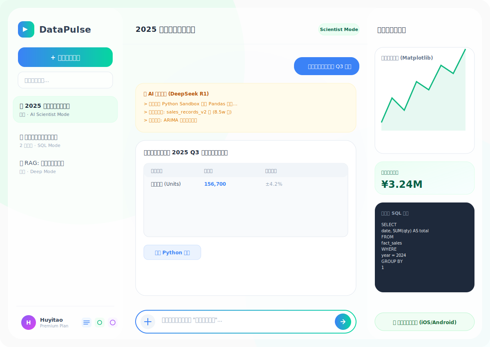
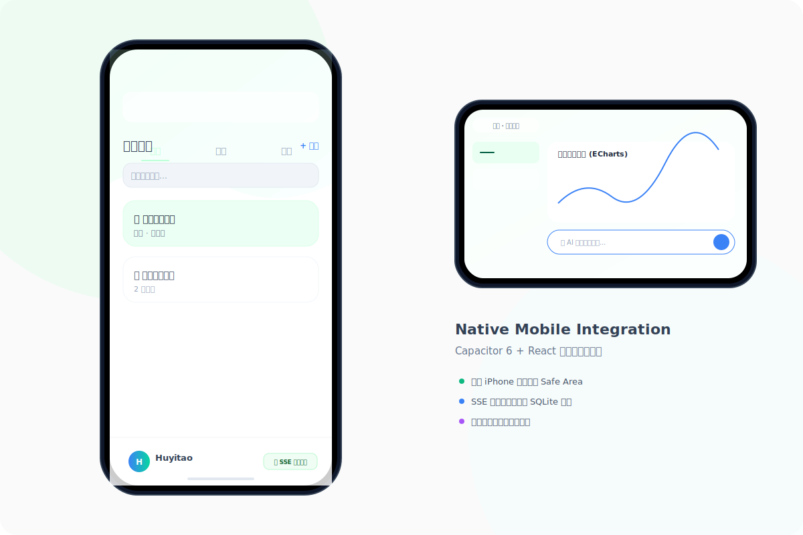
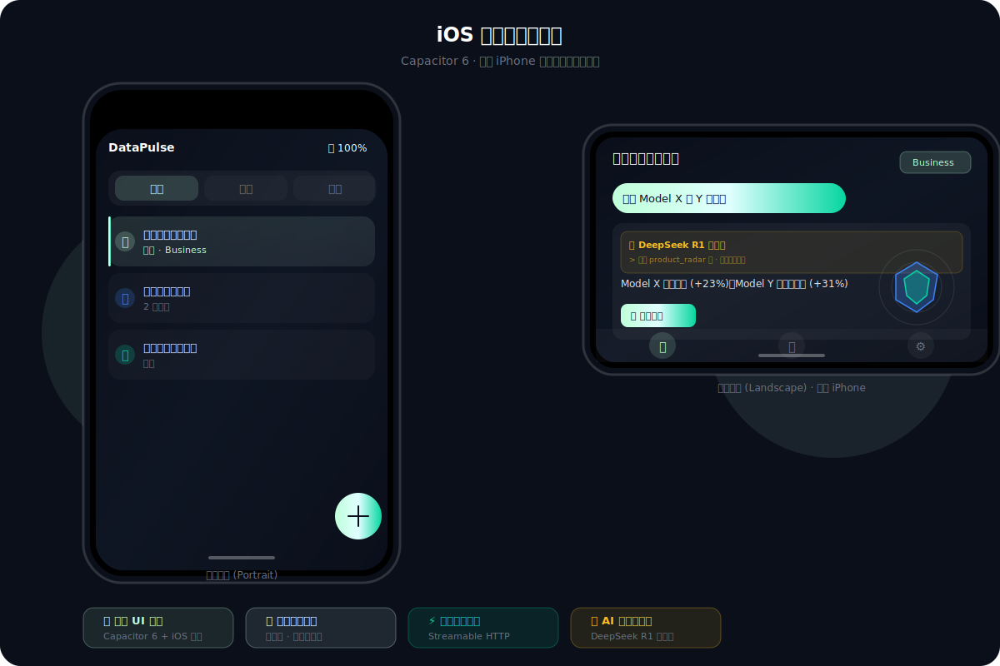
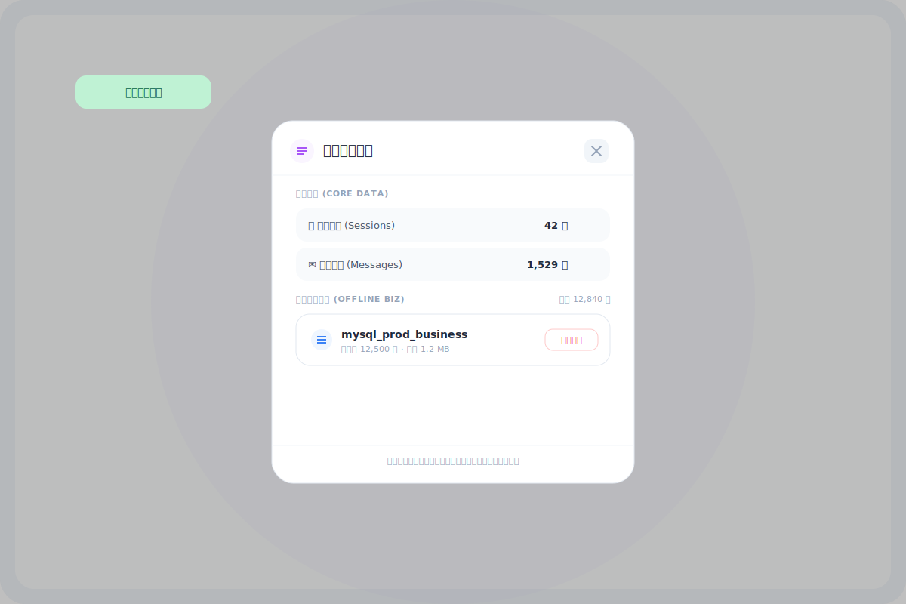

# DataPulse AI 数据分析系统 (v3.1)

[](https://github.com/CadanHu/data-analyse-system)

DataPulse 是一款专为现代企业设计的全栈 AI 数据分析中台。它不仅支持传统的 SQL 查询，更引入了 **AI 数据科学家模式 (v3.0)**，通过 Python 沙盒环境实现复杂的数学建模、自动化清洗与高清图表渲染。

---

## 📸 界面预览

### 🖥️ 桌面端控制台

*三栏式布局 · 实时推理流 · Python 沙盒 · 多图表动态切换 · SQL 预览*

### 📱 移动端原生适配
| 竖屏模式 | 横屏模式 |
| :---: | :---: |
|  |  |
*Capacitor 6 原生适配  · 触控优化 · Safe Area 支持*

### 🗄️ 本地数据管理

*SQLite 数据统计 · 缓存一键清理 · 业务数据同步状态 · 存储优化*

---

## 🌟 核心特性 (v3.0 升级版)

### 1. 🧠 AI 数据科学家模式 (Python 驱动)
*   **安全沙盒执行**：内置 AST 审计的 Python 执行沙盒，支持 Pandas、Numpy、Scipy、Matplotlib 和 Seaborn。
*   **多表自动关联**：AI 能够自动识别数据库 Schema，自主编写 Python 代码完成多表 Join 与交叉统计。
*   **复杂建模能力**：支持趋势预测、相关性分析、异常检测等传统 SQL 难以实现的深度任务。
*   **外部数据载入 (BYOD)**：支持外部 Agent 在请求时直接携带私有数据集（JSON），系统将即时载入内存进行分析。

### 2. 📊 专业级可视化输出
*   **高清绘图捕获**：自动捕获 Matplotlib/Seaborn 生成的图像，提供 Base64 高清预览与大图查看按钮。
*   **动态 ECharts 看板**：同步生成前端交互式图表配置，支持深色极客风主题。
*   **自动折叠长代码**：前端对 AI 生成的冗长 Python 脚本进行智能折叠，确保用户专注于分析结论。

### 3. 💎 深度知识提取 (MinerU 集成)
*   **多模态文档处理**：支持扫描版 PDF、复杂图片、Excel 报表的高精度识别。
*   **知识库增强 (RAG)**：通过语义检索（Vector Store）将非结构化文档内容注入分析上下文。

### 4. 📱 移动端完全本地知识库（v3.1 新增）

手机端无需后端服务器，三种 PDF 处理模式，全部在设备本地完成：

| 模式 | 技术 | 依赖 |
|------|------|------|
| ⚡ 标准模式 | PDF.js 本地解析 | 无需 Key |
| 🧠 深度模式 | MinerU Cloud API | MinerU Key（免费）|
| 💎 知识抽取 | MinerU + LLM 实体抽取 + 知识图谱 | MinerU Key + LLM Key |

*   **本地向量搜索**：支持 Qwen/智谱/Jina/Google 四家 Embedding，有 Key 则语义搜索，无 Key 自动降级到 SQLite FTS5 关键词搜索。
*   **知识图谱可视化**：知识抽取完成后自动提取实体和关系，展示可交互的 ECharts 图谱。
*   **完全无需 VPN 可用**：DeepSeek / Qwen / MiniMax / MinerU / 智谱均可国内直连。
*   详见：[MOBILE_KNOWLEDGE_SPEC.md](./MOBILE_KNOWLEDGE_SPEC.md)

### 5. 🔑 统一 Key 配置中心（v3.1 新增）

所有 API Key 在应用内统一管理，涵盖：
*   大语言模型：DeepSeek、通义千问、MiniMax、OpenAI、Claude、Gemini
*   PDF 解析：MinerU
*   向量搜索：Qwen Embedding、智谱、Jina AI、Google Embedding

### 6. 🌐 移动端与开发者友好
*   **全平台适配**：针对移动端手势与视口（dvh）进行精准优化。
*   **实时日志流 (SSE)**：后端状态、AI 思考过程与系统日志实时推送到前端。

---

## 🚀 快速开始

### 方案 A：Docker 快速部署 (推荐)
```bash
# 克隆仓库
git clone https://github.com/CadanHu/data-analyse-system.git

# 一键启动 (包含 MySQL/PostgreSQL 自动初始化与 16万+ 仿真数据填充)
docker-compose up --build
```

### 方案 B：本地开发环境
1.  **后端**：
    ```bash
    cd backend
    python -m venv venv312
    source venv312/bin/click/activate
    pip install -r requirements.txt
    python main.py
    ```
2.  **前端**：
    ```bash
    cd frontend
    npm install
    npm run dev
    ```

---

## 🛠️ 技术栈

*   **前端**: React (TypeScript) + Tailwind CSS + Vite + Lucide Icons
*   **后端**: FastAPI + SQLAlchemy (Async) + LangChain
*   **AI 引擎**: OpenAI / Gemini / Claude / DeepSeek (多模型支持)
*   **数据处理**: Pandas + Matplotlib + Seaborn + Scikit-learn
*   **数据库**: MySQL (业务数据) + PostgreSQL (知识库/向量存储)

---

## 🤖 外部 Agent 调用示例

DataPulse 现已开放“数据分析中台”能力，支持外部 Agent 携带私有数据发起请求：

```python
import requests

url = "http://your-server:8000/api/chat/stream"
payload = {
    "question": "分析这份竞品数据并画图",
    "enable_data_science_agent": True,
    "external_data": [
        {"Brand": "A", "Share": 30},
        {"Brand": "B", "Share": 70}
    ]
}

# 响应中将包含流式文字报告、Python 代码及图像 Base64
response = requests.post(url, json=payload, stream=True)
```

---

## 📅 路线图
- [ ] **多租户 API Key 管理**：支持 M2M 调用的鉴权与频率限制。
- [ ] **MCP 协议支持**：实现 Model Context Protocol 接口。
- [ ] **自动化 PPT 生成**：将分析看板一键导出为演示文稿。
