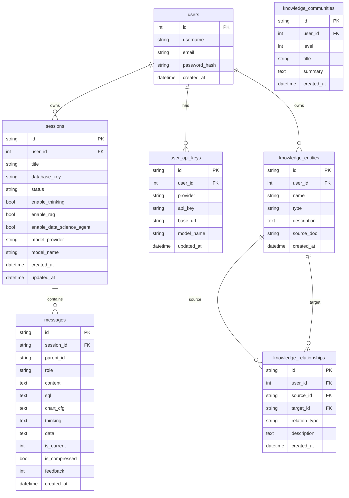

# 规格：核心数据模型 (Data Models)

> 来源：`backend/database/session_db.py` + `backend/models/message.py` 逆向
> 版本：v3.0

---

## 1. Session（会话）

**表名**：`sessions`

| 字段 | 类型 | 默认值 | 说明 |
|------|------|--------|------|
| `id` | String(64) | 必填 | UUID，主键 |
| `user_id` | Integer | 必填 | 所属用户 ID |
| `title` | String(255) | null | 会话标题（空时触发自动命名） |
| `database_key` | String(64) | `"business"` | 当前选中的数据库 key |
| `status` | String(20) | `"active"` | 状态：`active` / `archived` / `deleted` |
| `enable_data_science_agent` | Boolean | false | 科学家模式开关 |
| `enable_thinking` | Boolean | false | 思考模式开关 |
| `enable_rag` | Boolean | false | RAG 模式开关 |
| `model_provider` | String(32) | null | 供应商：`deepseek`/`openai`/`gemini`/`claude` |
| `model_name` | String(128) | null | 具体模型名称 |
| `created_at` | DateTime | now | 创建时间 |
| `updated_at` | DateTime | now | 更新时间（自动） |

**约束**：
- 模式开关与 `sessions` 表记录强绑定，刷新页面后状态不丢失
- `status` 字段变更路径：`active → archived`，`active → deleted`（不可逆）

---

## 2. Message（消息）

**表名**：`messages`

| 字段 | 类型 | 默认值 | 说明 |
|------|------|--------|------|
| `id` | String(64) | 必填 | UUID，主键 |
| `session_id` | String(64) | 必填 | 外键 → `sessions.id` |
| `parent_id` | String(64) | null | 父消息 ID，支持对话分支 |
| `role` | String(20) | 必填 | `user` / `assistant` |
| `content` | Text | 必填 | 消息正文 |
| `sql` | Text | null | 生成的 SQL 语句 |
| `chart_cfg` | Text | null | ECharts 配置 JSON |
| `thinking` | Text | null | AI 思维链内容 |
| `data` | Text | null | SQL 执行结果 JSON / 报告状态 |
| `is_current` | Integer | 1 | 分支状态：`1` 活跃 / `0` 历史 |
| `is_compressed` | Boolean | false | 是否已被 HistorySummarizer 压缩 |
| `feedback` | Integer | 0 | 用户反馈：`1` 点赞 / `-1` 点踩 / `0` 无 |
| `feedback_text` | Text | null | 反馈详细说明 |

**约束**：
- 科学家模式的 `thinking` 字段必须为空（不存储推理内容）
- `is_compressed = true` 的消息不参与上下文构建，由 HistorySummarizer 管理

---

## 3. UserApiKey（用户 API Key）

**表名**：`user_api_keys`

| 字段 | 类型 | 说明 |
|------|------|------|
| `id` | String(64) | UUID，主键 |
| `user_id` | Integer | 所属用户 |
| `provider` | String(32) | 供应商：`deepseek`/`openai`/`gemini`/`claude` |
| `api_key` | String(512) | 用户的 API Key |
| `base_url` | String(255) | 自定义 Base URL（可选） |
| `model_name` | String(128) | 该供应商的默认模型名称（可选） |

**约束**：
- 同一用户同一 provider 只能有一条记录（UNIQUE 约束：`user_id` + `provider`）
- `api_key` 不得明文返回给前端（只返回掩码版本）

---

## 4. ERD（实体关系图）

**数据库分布**：

| 表 | 存储位置 |
|----|---------|
| `users`、`sessions`、`messages`、`user_api_keys` | MySQL（系统库） |
| `knowledge_entities`、`knowledge_relationships`、`knowledge_communities` | PostgreSQL（知识库） |

---

## 5. 状态机参考

详细的状态转换图见 `data-sys-docs/state-machines/`：
- `session.md` — 会话生命周期
- `message.md` — 消息多维状态
- `auth.md` — 认证状态
- `chat-flow.md` — 对话处理流状态机
- `datasource.md` — 数据源状态
- `report.md` — 报告生成状态
